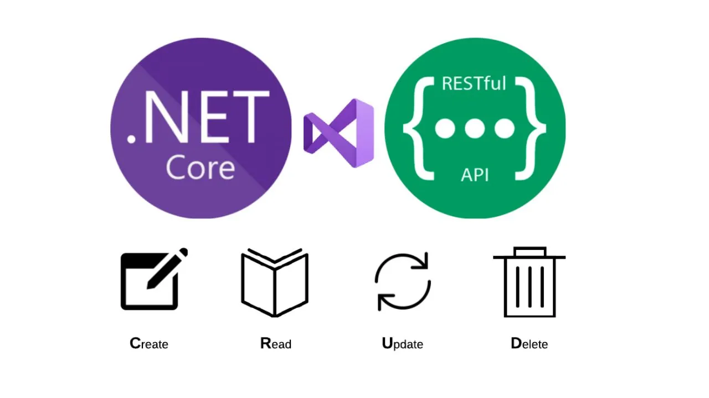

# PersonasBasicRestNet

Ejemplo de una API REST básica en .NET Core 8



- [PersonasBasicRestNet](#personasbasicrestnet)
  - [Descripción](#descripción)
  - [Endpoints](#endpoints)
  - [Modelo de Entrada](#modelo-de-entrada)
  - [Modelo de Salida](#modelo-de-salida)
  - [Librerías usadas](#librerías-usadas)


## Descripción

Este proyecto es un ejemplo de una API REST básica en .NET Core 8. La API permite realizar operaciones CRUD sobre una colección de personas/heroes.

## Endpoints

| Método | Endpoint | Descripción | Status Code |
| ------ | -------- | ----------- | ----------- |
| GET | /heroes | Obtiene la lista de heroes | 200 |
| GET | /heroes/{id} | Obtiene un hero por su id | 200, 404 |
| POST | /heroes | Crea un nuevo hero | 201, 400 |
| PUT | /heroes/{id} | Actualiza un hero por su id | 204, 400, 404 |
| DELETE | /heroes/{id} | Elimina un hero por su id | 204, 404 |

## Modelo de Entrada

```json
{
  "id": 1,
  "name": "Superman",
  "isBad": true
}
```

## Modelo de Salida

```json
{
  "id": 1,
  "name": "Superman",
  "isBad": true,
  "createdAt": "2021-09-01T00:00:00",
  "updatedAt": "2021-09-01T00:00:00"
}
```

## Librerías usadas
- Microsoft.AspNetCore.OpenApi: Para la documentación de la Api
- Microsoft.EntityFrameworkCore: Para la persistencia de datos
- Microsoft.EntityFrameworkCore.InMemory: Para la persistencia de datos en memoria
- Serilog: Para el logging
- Serilog.Extensions: Para el logging, extensiones de formato
- Serilog.Sinks.Console: Para el logging en consola
- Swashbuckle.AspNetCore: Para la documentación de la Api
- Swashbuckle.AspNetCore.Annotations: Para la documentación de la Api, anotaciones
